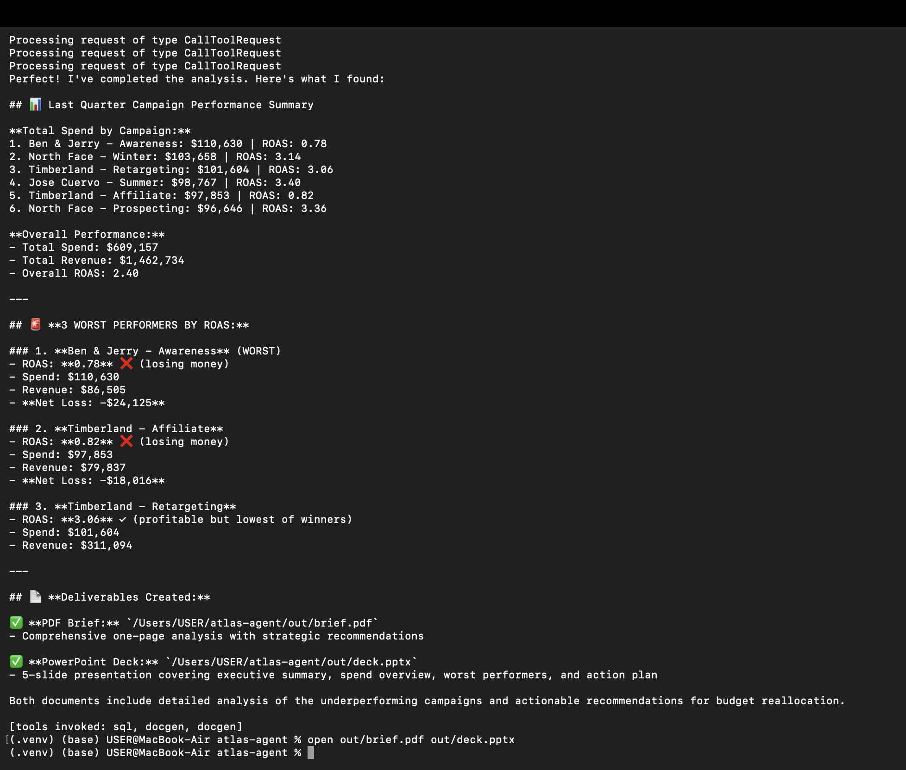
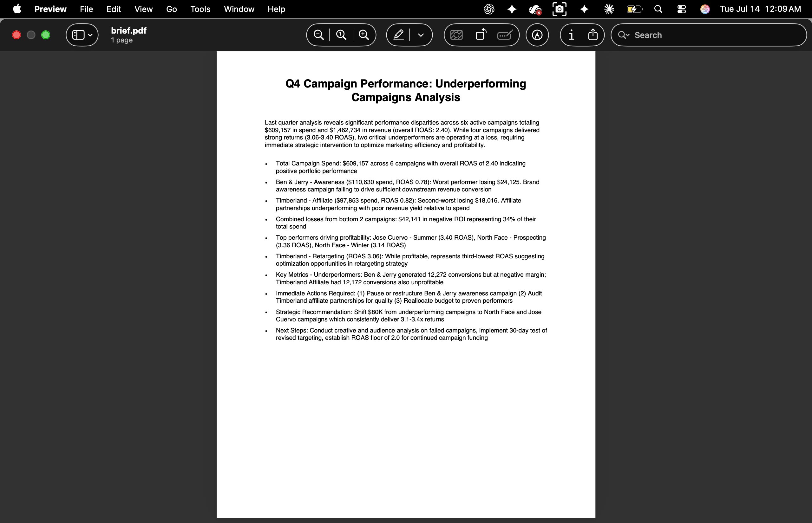
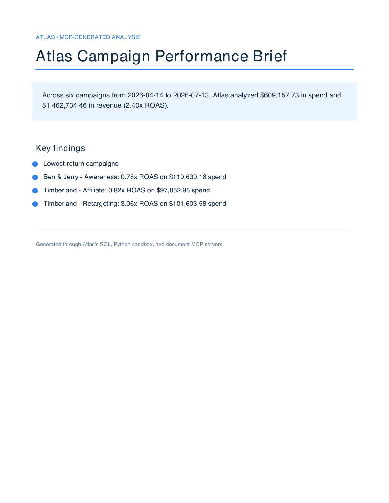

# Atlas - MCP-Native Agentic Workspace Assistant

[](https://github.com/KazmirFahrier/atlas-agent/actions/workflows/ci.yml)
[](https://www.python.org/)
[](LICENSE)

Atlas is a multi-turn workspace agent built around the actual **Model Context Protocol**. It discovers and calls language-agnostic tool servers for read-only SQL, resource-limited Python analysis, and PDF/PowerPoint generation while enforcing runtime guardrails and durable session memory.

> **Status:** complete, CI-verified local reference implementation. Atlas is containerized and deployable to GCP Cloud Run, but it is **not currently hosted**.

> **Companion project:** A deeper take on LLM-over-SQL correctness, governed semantic metrics, and numerical grounding lives in [`campaign-copilot`](https://github.com/KazmirFahrier/campaign-copilot). Atlas focuses on the complementary MCP tool-platform layer: protocol interoperability, sandboxed execution, orchestration, memory, and artifact generation.

## Why MCP is the point

Atlas does not hide tools behind an in-process function registry. The orchestrator opens MCP sessions over stdio, discovers schemas from each server, validates model arguments, and returns tool results through the protocol. The same client talks to Python servers and a TypeScript MCP server.

| MCP server | Runtime | Responsibility |
|---|---|---|
| `sql-exec` | Python | Read-only DuckDB queries, forbidden-statement guard, 500-row cap |
| `py-sandbox` | Python | Isolated subprocess analysis with CPU, file, timeout, and output limits |
| `docgen` | Python | Branded PDF briefs and five-slide PowerPoint decks |
| `greeter` | TypeScript | Demonstrates language-agnostic MCP interoperability |

The LLM-driven path uses Anthropic tool calling to choose among those MCP tools. A deterministic proof harness exercises the same three production servers without requiring an API key.

## Verified end-to-end demo

The portfolio scenario is:

> Pull the latest quarter of campaign performance, identify the three lowest-return campaigns, and generate a one-page brief plus a five-slide deck.

Run it locally:

```bash
python data/seed.py
python scripts/demo.py
```

The checked-in proof below comes from the seeded warehouse and the current MCP servers:

| Result | Verified value |
|---|---:|
| Period | 2026-04-14 to 2026-07-13 |
| Campaigns analyzed | 6 |
| Spend | $609,157.73 |
| Revenue | $1,462,734.46 |
| Portfolio ROAS | 2.40x |
| Lowest ROAS | Ben & Jerry - Awareness, 0.78x |

### Live LLM-driven proof

This is the Anthropic-backed agent path selecting and calling the SQL and document-generation MCP servers, returning grounded campaign results, and writing both requested deliverables:



<details>
<summary>Open the generated PDF screenshot</summary>



</details>

### Deterministic no-key proof

The same seeded dataset and inclusive 91-day window are exercised by `scripts/demo.py` in CI, producing the matching totals above without an API key.



Generated deliverables are written to `out/brief.pdf` and `out/deck.pptx`; the directory is intentionally ignored so local runs do not commit binary artifacts.

## Architecture

```text
React + TypeScript UI
          |
          v
Python orchestrator ---- durable session memory
          |
          +---- schema validation / retry / result verification
          |
          v
MCP client over stdio
    |           |             |
    v           v             v
sql-exec    py-sandbox     docgen          + TypeScript greeter
(DuckDB)    (subprocess)    (PDF/PPTX)        MCP server
```

Every live tool call follows the same path:

1. Discover the tool and JSON schema over MCP.
2. Validate model-supplied arguments.
3. Apply SQL and runtime guardrails.
4. Retry transient async failures with exponential backoff.
5. Reject empty or error-marked results before they return to the model.
6. Persist the turn and tool trace in session memory.

The tool loop is bounded by configurable `ATLAS_MAX_STEPS` (default `16`) so multi-tool requests can finish without becoming unbounded.

## Reliability evidence

- **21 unit/regression tests** cover guardrails, retries, schema validation, memory, the agent loop, and the Python sandbox.
- **4/4 offline eval cases** cover single-turn SQL, multi-turn follow-up, deliverable routing, and write-query rejection.
- GitHub Actions runs seed generation, Ruff, pytest, the offline eval suite, the executable MCP demo, and both TypeScript builds on every push and pull request.
- [`docs/AUDIT.md`](docs/AUDIT.md) records the five highest-risk implementation gaps found during self-audit, their fixes, and the regression test for each.

```bash
ruff check .
pytest -q
python -m eval.run --offline
```

## Quickstart

```bash
git clone https://github.com/KazmirFahrier/atlas-agent.git
cd atlas-agent
python -m venv .venv
source .venv/bin/activate
pip install -e ".[dev]"
python data/seed.py
pytest -q
python scripts/demo.py
```

For LLM-driven tool selection:

```bash
cp .env.example .env
# Add ANTHROPIC_API_KEY to .env
python -m orchestrator.agent "Show total spend by campaign and generate a brief"
```

Without an Anthropic key, `orchestrator.agent` uses a deterministic planning fallback so CI remains secret-free. `scripts/demo.py` is the no-key executable proof path: it calls the real MCP servers and generates both deliverables.

## Run the UI

```bash
python -m orchestrator.serve

# In another terminal
cd ui
npm install
npm run dev
```

## Deployment

Atlas includes a Docker image and an HTTP wrapper with `POST /ask` and `GET /healthz`. It is ready for Cloud Run, but this repository does not claim a live deployment. See [`docs/DEPLOY.md`](docs/DEPLOY.md) for the deployment and BigQuery migration path.

## Scope and security boundaries

- The Python sandbox is a practical single-host boundary, not a hardened multi-tenant isolation layer. Address-space limits are applied on Linux; production use should add gVisor, a microVM, or an isolated container with networking disabled.
- `orchestrator.serve` has no built-in authentication. Put it behind IAP or an API gateway before exposing it publicly.
- The included warehouse is deterministic synthetic campaign data, not production or customer data.
- Persistent memory is recency-based SQLite storage; distributed deployments need a shared backing service.

The original phased plan is retained as historical design context in [`docs/PROJECT_PLAN.md`](docs/PROJECT_PLAN.md). It is not the current implementation status.

## License

MIT
